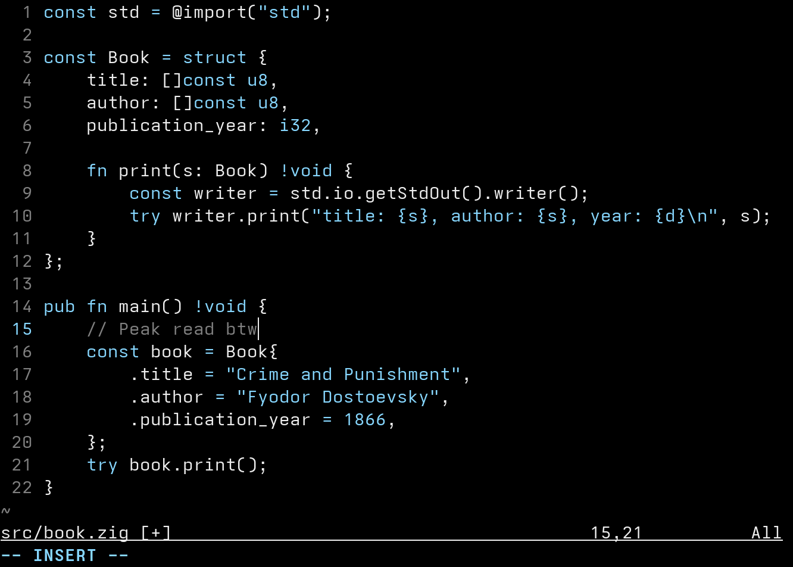
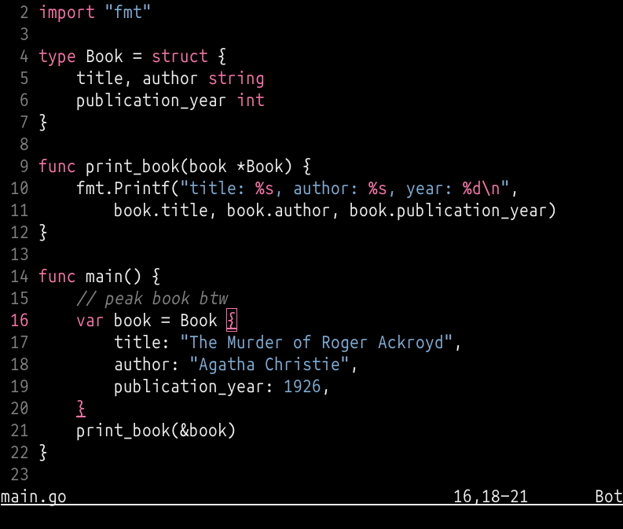
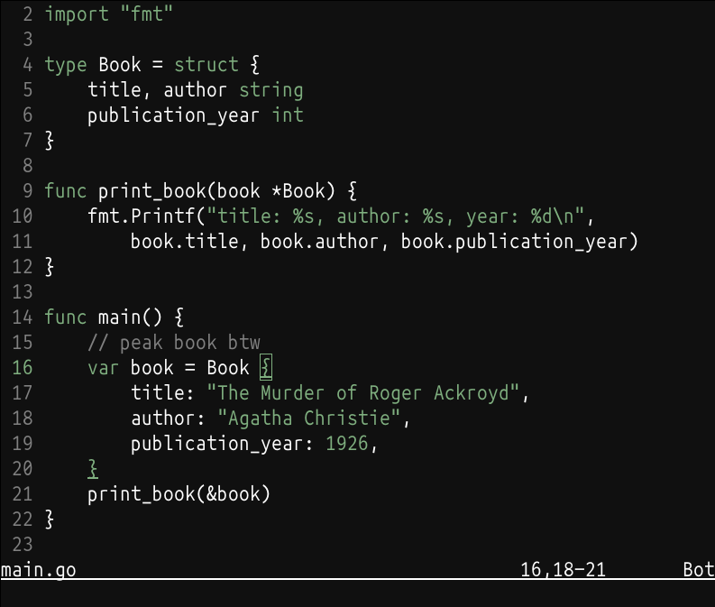
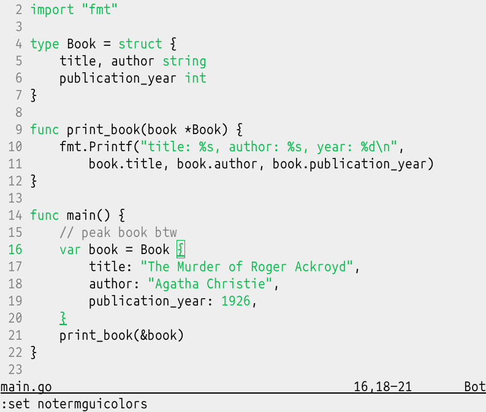

<h1 align="center">Momo</h1>
<p align="center">Minimalistic dark theme for vim.</p>

<p align="center">Original theme on the left, slight recolor on the right.</p>

## Install
Installation may vary depending on how you manage your plugins,
for example, when using [vim-plug](https://github.com/junegunn/vim-plug), add
```vim
Plug 'miublue/momo.vim'
```
to your init file.

## Configuration
Put this on your _~/.vimrc_:
```vim
colorscheme momo
```

Background color can be turned off (it will use the terminal's background color):
```vim
let g:momo_transparent_background = 1
```

Comments can be turned italics:
```vim
let g:momo_italic_comments = 1
```

Keywords can be turned bold:
```vim
let g:momo_bold_keywords = 1
```

All colors can be changed:
```vim
" colors are [hex, ansi]
let g:momo_background_color = ["#000000", 0]
let g:momo_foreground_color = ["#eeeeee", 255]
let g:momo_comment_color    = ["#8a8a8a", 245]
let g:momo_highlight_color  = ["#87d7ff", 117]
let g:momo_function_color   = ["#ff5faf", 205]
let g:momo_constant_color   = ["#5fffaf", 85]

" you may set all the ansi colors to zero if you are too lazy
" to find a good-looking 256-color replacement and are *100% sure*
" that you will only be using it with true color support.
" otherwise, you can set only the ansi colors with `notermguicolors` set.
```

## Examples

Momo supports just enough customization for you to have plenty of colors,
but not enough to end up looking like a clown just threw up on your screen.

### Terminal colors
```vim
set notermguicolors " i'll only be using my own terminal colors here
let g:momo_transparent_background = 1
let g:momo_italic_comments = 1
let g:momo_highlight_color = ['#000000', 1] " red keywords
let g:momo_constant_color  = ['#000000', 4] " blue strings/numbers
colorscheme momo
```


### Adaptative
```vim
" if you set notermguicolors, background and foreground colors
" should adapt for dark/light terminals when using colors 0..15
let g:momo_background_color = ['#101010', 0] " black background
let g:momo_foreground_color = ['#ffffff', 7] " white foreground
let g:momo_highlight_color  = ['#7faf7f', 2] " green everything
colorscheme momo
```



## Notes

- Options should be set before setting colorscheme.
- Colors may look off if your terminal colors are shit.
- Comments are always gray by default.
- `momo_highlight_color` is the default color for keywords, types and labels.
- Constants will use the same color as keywords if `momo_constant_color` is not defined.
- Functions will use foreground color if `momo_function_color` is not defined.

